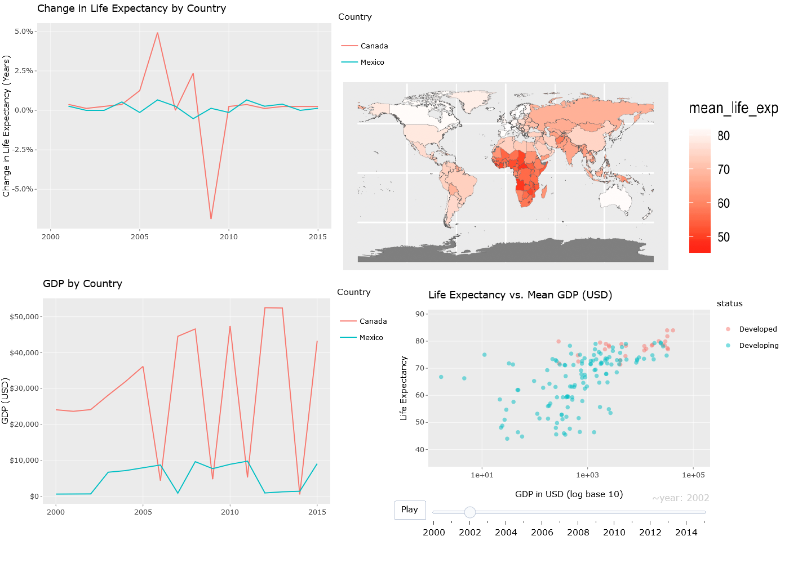
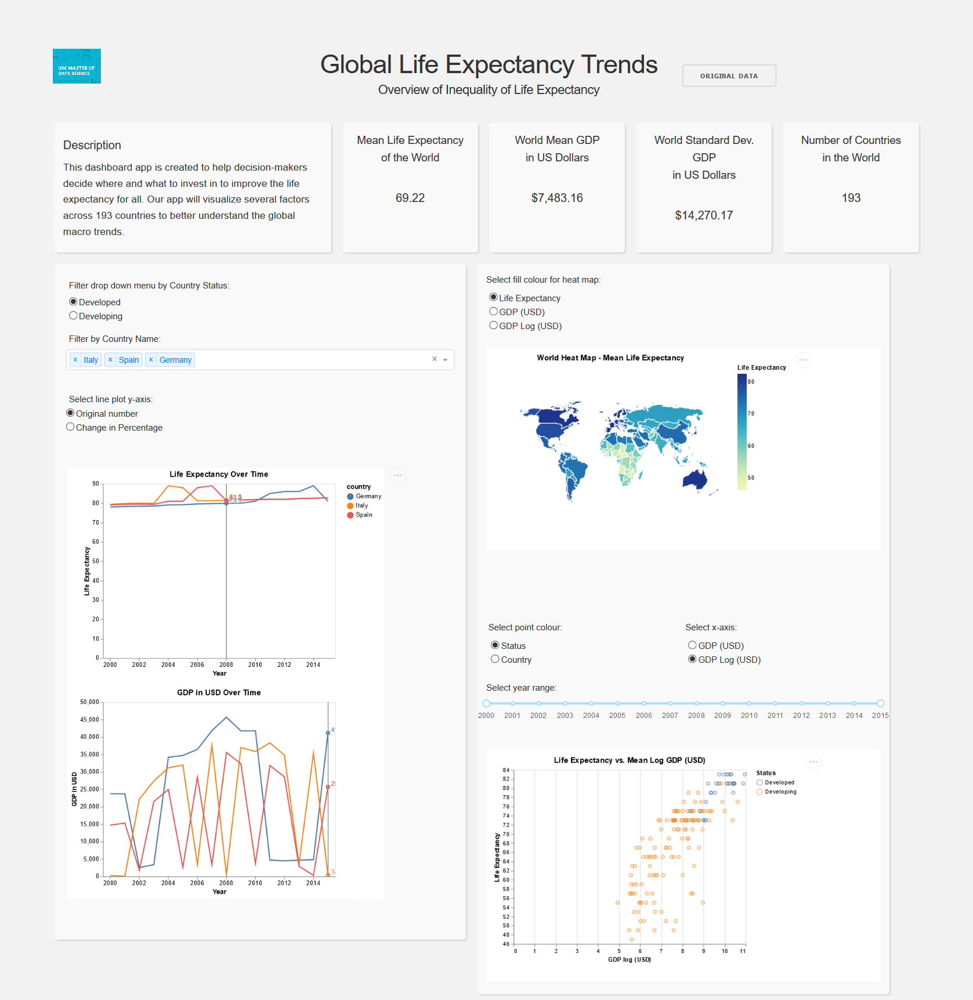

# Project 2 - Life Expectancy Dashboard in R

## Background

This repo was created as a submission for class DSCI 532 as part of the Masters of Data Science program at the University of British Columbia.

Team members (group 101):

- Jake Lee
- Sam Edwardes
- Zoe Pan

## Milestone 3:

- [Project Proposal](docs/proposal.md)
- [Code of Conduct](docs/team-code-of-conduct.md)
- [App Description and Sketch](#app-description-and-sketch)  
- Current progress:  

## Milestone 4:

Next week

## App Description and Sketch

The app contains one page that includes four summary statistics and four main plots. The summary statistics are about the average life expectancy, average GDP around the world, standard deviation of GDP of all countries and the count of the countries in total in our dataset. The left column are line plots that visualize `life expectancy`, `GDP` (gross domestic product) over time by country or `life expectancy` and `GDP` change in percentage year over year. The right column of plots includes a geographic heat map that can compare `life expectancy`, `GDP`, or `GDP log` and a scatter plot of `life expectancy` by `GDP` or `GDP log` for selected year range for all countries.

We include `GDP log` variable for the heat map and scatter plot, because of the right skewness of the GDP distribution of all countries. With `GDP log`, some patterns may become more obvious.

One of the most interesting features of this dashboard is the ability to change the variable each plot explores. By allowing the user to choose the variable of the y-axis, select countries through filtered country status for time series plots, the colour variable for the heat map, and year range, x-axis for the scatter plot, users are able to answer many potential questions with a limited number of plots and screen real estate.

The dashboard will also include interactive elements. Tooltips will be used on all data points to allow the user to see precise values. The summary numbers at the top of the dashboard will serve as a “grounding point” so the user can easily compare individual observations to in view averages. 

